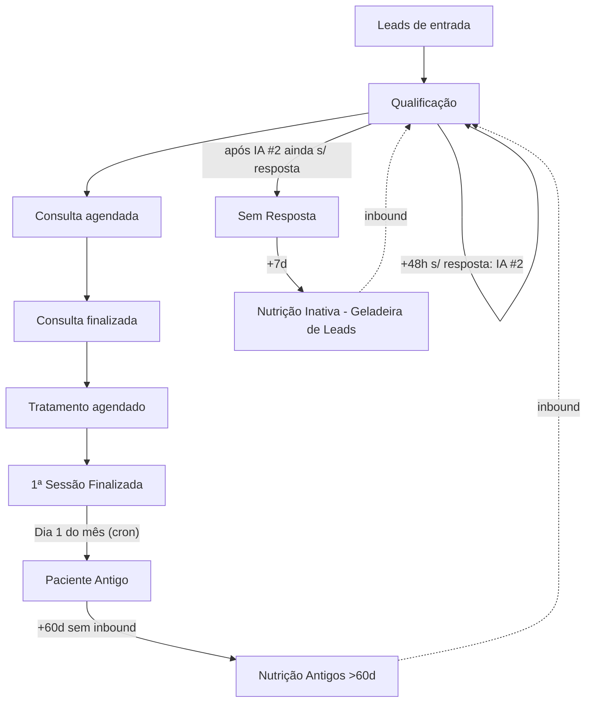

# Clínica ÓR — Fluxo novo do pipeline

Escopo: **somente** `clinic_id = cf038458-457d-4c1a-9ac4-c88c3c8353a1`, pipeline `Clínica ÓR` (`17c27f4d-8256-4ea7-b5b9-ed706494f686`).

## Diagrama

## Stages (renome + nova)

| Pos | Nome novo | Mudança |
|---|---|---|
| 6 | **1ª Sessão Finalizada** | renomeada de "Em tratamento" (id mantido `2a352661-...`) |
| 8 | **Nutrição Inativa (Geladeira de Leads)** | renomeada de "Nutrição inativa" (id mantido `64356dbe-...`) |
| 11 | **Nutrição Antigos (>60d)** | nova |

## Regras temporais (resumo)

| Origem | Gatilho | Destino / Ação |
|---|---|---|
| Qualificação | +24h sem resposta | IA follow-up #1 (mantém stage) |
| Qualificação | +48h sem resposta | IA follow-up #2 (mantém stage) |
| Qualificação | após #2 ainda sem resposta | Move → Sem Resposta |
| Sem Resposta | +7 dias parado | Move → Nutrição Inativa (Geladeira) |
| 1ª Sessão Finalizada | Dia 1 do mês (cron `pipeline-monthly-cycle-or`) | Move → Paciente Antigo |
| Paciente Antigo | +60d sem inbound | Move → Nutrição Antigos (>60d) |
| Qualquer geladeira | mensagem inbound | Move → Qualificação |

## Tags automáticas (coluna `pipeline_stages.auto_tag_on_enter`)

| Stage | Tags aplicadas ao entrar |
|---|---|
| Sem Resposta | `sem_resposta` |
| Nutrição Inativa (Geladeira de Leads) | `nutricao_inativa`, `segmento_nutricao_leads` |
| Nutrição Antigos (>60d) | `nutricao_antigos`, `segmento_nutricao_antigos` |
| Paciente Antigo | `paciente_antigo`, `segmento_paciente_antigo` |
| Consulta Finalizada | `consulta_finalizada_mes`, `segmento_relatorio_dia1` |
| 1ª Sessão Finalizada | `tratamento_finalizado_mes`, `segmento_relatorio_dia1` |

Trigger: `apply_stage_auto_tags()` após INSERT em `lead_stage_history` mescla as tags no array `leads.tags` (sem duplicar).

## Segmentos de sistema (`email_segments.is_system = true`)

- `seg_nutricao_leds` — `tags @> {segmento_nutricao_leads}`
- `seg_nutricao_antigos` — `tags @> {segmento_nutricao_antigos}`
- `seg_paciente_antigo` — `tags @> {segmento_paciente_antigo}`
- `seg_relatorio_dia1` — `tags @> {segmento_relatorio_dia1}` no mês corrente

## Relatório Dia 1

Edge function `report-finalizados-mensal-or` (cron `0 6 1 * *`) conta leads que entraram em `Consulta Finalizada` e `1ª Sessão Finalizada` no mês anterior (via `lead_stage_history`), persiste em `clinic_monthly_reports`, envia email para o admin e renderiza card em `/tracking`.
