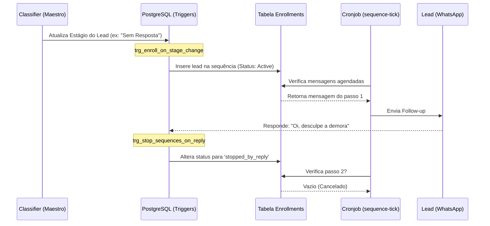

# O Motor de Sequências: Integração entre IA, Banco e Automações (Clínica ÓR)

O disparo de mensagens em sequência (como *Follow-ups* de abandono ou aquecimento) opera sobre um tripé arquitetural altamente desacoplado. Neste documento, explicamos como a Inteligência Artificial (Maestro) conversa com o enviador de mensagens sem que um "saiba" da existência do outro.

## 1. O Tripé de Responsabilidades

O fluxo funciona como uma engrenagem tripla orquestrada silenciosamente pelo banco de dados:

1. **A Inteligência Artificial (O Gatilho Lógico)**
   O agente `Maestro` do *Classifier* avalia a conversa e decide mudar o estágio do lead (ex: rebaixa um lead "Sem Resposta" para "Nutrição Inativa" após avaliar intenções de desistência). A IA termina seu trabalho aqui. Ela **não manda mensagens**.
   
2. **O Banco de Dados (A Ponte Invisível)**
   Assim que o Postgres confirma a atualização (`UPDATE leads SET stage_id`), o trigger de banco de dados `trg_enroll_on_stage_change` é acionado instantaneamente.
   - O Trigger verifica na tabela `message_sequences` se existe alguma sequência vinculada àquele estágio com o tipo `stage_enter`.
   - Se houver, o Trigger **inscreve silenciosamente** o lead na tabela `message_sequence_enrollments`.

3. **As Automações (O Mensageiro)**
   Uma Edge Function chamada `sequence-tick` atua como cronjob (geralmente rodando a cada minuto).
   - Ela varre a tabela de inscrições (`enrollments`) buscando tarefas atrasadas ou no momento exato (`next_run_at <= now()`).
   - Dispara as mensagens usando os templates predefinidos em `message_sequence_steps` e avança o contador da inscrição para a próxima mensagem, reagendando o `next_run_at`.

---

## 2. O Escudo de Defesa (Parada Imediata)

A maior reclamação em CRMs com sequências é o robô enviando uma cobrança ou follow-up 5 minutos depois do paciente já ter respondido. Aqui, a arquitetura soluciona isso a nível de banco:

* **O Gatilho `trg_stop_sequences_on_reply`:**
  Sempre que chega uma mensagem onde `from_me = false` (o paciente respondeu), um trigger no banco de dados age no mesmo milissegundo.
  Ele varre todas as sequências ativas desse paciente que possuam a regra `stop_on_reply = true` e as muda para o status **`stopped_by_reply`**.
  Isso garante que, mesmo que o Cronjob do mensageiro (`sequence-tick`) acorde no segundo seguinte, ele já verá a sequência como parada, abortando envios indesejados.

---

## 3. O Fluxo de Vida Visual

## 4. Dicionário das Tabelas do Motor

Se você precisar depurar manualmente o envio de sequências ou consertar algo travado:

- **`message_sequences`**: A "Campanha" mestre. Controla o nome, se está ativa, a trava temporal (`cooldown_days`) para não mandar a mesma campanha pro lead repetidamente, e a regra `stop_on_reply`.
- **`message_sequence_steps`**: Os blocos de mensagem de uma campanha. Possui o `delay_minutes` que dita quanto tempo esperar antes de mandar a próxima mensagem, além do conteúdo/template.
- **`message_sequence_enrollments`**: A inscrição real do paciente. Se quiser parar a sequência manualmente, mude a coluna `status` de `active` para `canceled` no DBeaver.
- **`message_sequence_runs`**: O histórico e os logs de sucesso/erro de cada disparo. Útil para verificar por que um template do Meta falhou.
- **`stage_sequence_bindings`**: A tabela ponteira que relaciona um "Estágio de Funil" a uma sequência específica, evitando `trigger_config` sujos e amarrando o visual de UI.
